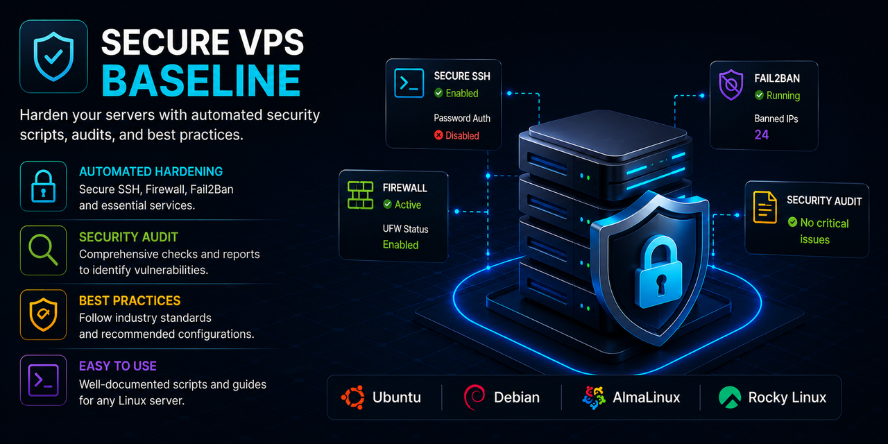

<p align="center">
  
</p>

<h1 align="center">Secure VPS Baseline</h1>

<p align="center">
Production-ready Linux VPS hardening with automated security scripts,
SSH protection, UFW firewall, Fail2Ban, security auditing, and operational best practices.
</p>

<p align="center">


</p>

---

# Overview

**Secure VPS Baseline** is a collection of practical hardening guides, configuration examples, and automation scripts designed to establish a secure Linux server baseline for production environments.

The project focuses on building repeatable security practices that are easy to understand, automate, and maintain across VPS deployments.

---

# Features

- 🔐 SSH hardening
- 🔥 UFW firewall configuration
- 🛡️ Fail2Ban protection
- 📋 Security auditing
- 📦 System update best practices
- 💾 Backup & recovery examples
- ⚙️ Automation scripts
- 📚 Production documentation

---

# Repository Structure

```text
.
├── assets/
│   └── images/
│       └── cover.png
├── docs/
│   └── Hardening guides
├── examples/
│   └── Configuration examples
├── scripts/
│   └── Automation scripts
├── .github/
│   └── workflows/
└── README.md
```

---

# Security Areas

## SSH Hardening

- Disable password authentication
- Enforce SSH key authentication
- Disable root login
- Restrict allowed users
- Harden SSH configuration

---

## Firewall

- UFW configuration
- Default deny policies
- Allow only required services
- IPv4 / IPv6 support

---

## Fail2Ban

- SSH brute-force protection
- Custom jail configuration
- Log monitoring
- Automatic IP banning

---

## System Hardening

- Security updates
- Package management
- Kernel parameters
- User management
- File permissions

---

## Backup & Recovery

- Backup automation
- Retention strategies
- Disaster recovery planning
- Backup verification

---

# Security Principles

- Least Privilege
- Defense in Depth
- Secure by Default
- Automation
- Repeatability
- Operational Simplicity

---

# Roadmap

- [ ] Automated server bootstrap
- [ ] CIS-inspired hardening
- [ ] Docker host hardening
- [ ] Security audit toolkit
- [ ] Compliance examples
- [ ] Monitoring integration
- [ ] Backup verification
- [ ] Production deployment examples

---

# Philosophy

> Security is not a product.
>
> **Security is a continuous process.**

---

# Contributing

Contributions, suggestions, and security improvements are welcome.

Please open an Issue before submitting major changes.

---

# License

This project is licensed under the **MIT License**.
